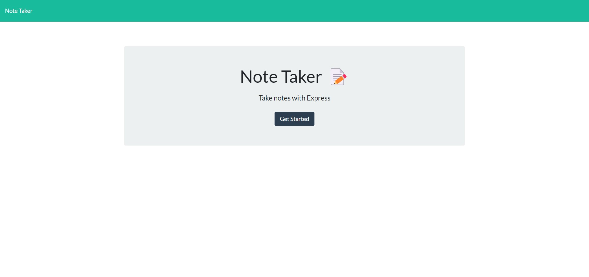
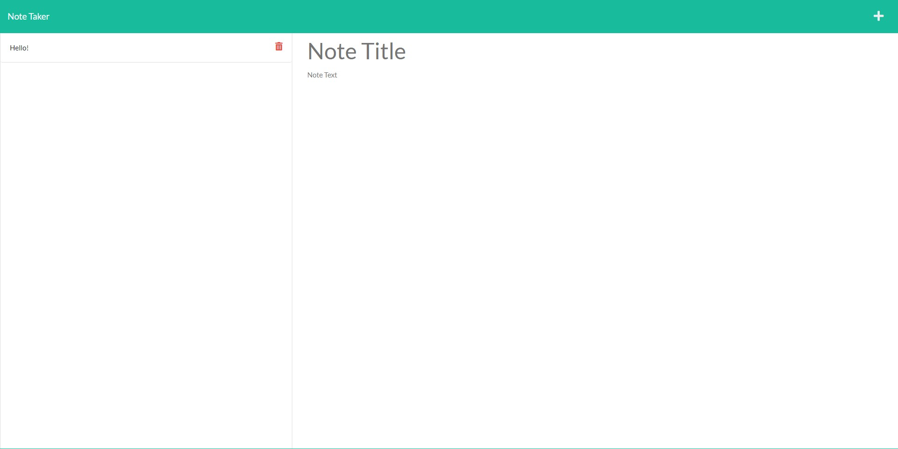

# Note Taker

## Description
Used to create notes, helping keep track of life! 

## Table of Contents (Optional)
* [Installation](#installation)
* [Usage](#usage)
* [Credits](#credits)
* [License](#license)
* [Contributing](#contributing)
* [Test](#test)
* [Questions](#questions)

## Installation
Clone the repo, then install the dependencies (found in package.json), run the server then begin making notes! 

## Usage
This is what it will look like on your device. 

[App Link](https://mynewnotetaker.herokuapp.com/)

   

## Contributions
Nicholas Kepers (With wonderful help from Jennifer Lucas and AskBCS!)